# RFM Segmentation - Predicting Number of Purchase, Customer Churn, Future Sales and LTV

<a name="readme-top"></a>

<summary>Table of Contents</summary>
<ol>
  <li><a href="#introduction">Introduction</a></li>
  <li><a href="#business-objective">Business Objective</a></li>
  <li><a href="#business-metrics">Business Metrics</a></li>
  <li><a href="#dataset-description">Dataset Description</a></li>
  <li>
    <a href="#feature-engineering">Feature Engineering</a>
    <ul>
      <li><a href="#handling-data-types">Handling Data Types</a></li>
      <li><a href="#handling-missing-values">Handling Missing Values</a></li>
    </ul>
  <li>
    <a href="#eda">EDA</a>
    <ul>
      <li><a href="#boxplot">Boxplot</a></li>
      <li><a href="#pearson-correlation-heatmap">Pearson Correlation Heatmap</a></li>
      <li><a href="#scatterplot">Scatterplot</a></li>
    </ul>
  <li>
    <a href="#analyzing-rfm">Analyzing RFM</a>
    <ul>
      <li><a href="#get-monetary-and-frequency-values">Get Monetary and Frequency Values</a></li>
    </ul>
  <li>
    <a href="#bgnbd-model-to-predict-frequency-and-customer-retention-rate">BG/NBD Model to predict Frequency and Customer Retention Rate</a>
    <ul>
      <li><a href="#paretonbd-model">Pareto/NBD Model</a></li>
      <li><a href="#bgnbd-model">BG/NBD Model</a></li>
      <li>
        <a href="#retention-model-beta-geofitter">Retention Model (Beta Geofitter)</a>
        <ul>
          <li><a href="#visualizing-frequencyrecency-matrix">Visualizing Frequency/Recency matrix</a></li>
          <li><a href="#estimating-number-of-purchase">Estimating Number of Purchase</a></li>
          <li><a href="#estimating-probability-of-customer-alive-retention-rate">Estimating Probability of Customer Alive (Retention Rate)</a></li>
        </ul>
      <li>
        <a href="#ltv-modelling">LTV Modelling (Gamma-Gamma Fitter)</a>
        <ul>
          <li><a href="#estimate-the-average-transaction-value">Estimate the average transaction value</a></li>
          <li><a href="#estimating-customer-lifetime-value">Estimating Customer Lifetime Value</a></li>
        </ul>
    </ul>
  <li><a href="#conclusion">Conclusion</a></li>
</li>
</ol>


<!-- Introduction -->
# Introduction

&emsp;&emsp; Approaching all customer during marketing campaign do taking much effort in term of time and less effective. Marketing team is should be able to group customers in certain segments or cluster and analyze their profitability. **RFM Segmentation** is basically used as scoring technique to segmented customer behavior based on their latest date of purchase, number of puchase and amount spent. Frequency and Monetary value is highly related to Customer Lifetime Value while Recency is closely affects the retention.

- **`Recency`** : Latest time since last purchase in period of time (days, week, year)
- **`Frequency`** : Number of purchase (transactions) made by customer in period of time
- **`Monetary`** : Total amount spent of purchase (transactions) in periode of time

More recent the purchase means the customer is more responsive to promotions and more frequently customer made purchases, means customer made more engangement.

<p align="right">(<a href="#readme-top">back to top</a>)</p>

# Business Objective

The main objective is to allows the company to maximize the profit of the next targeted marketing campaign.

# Business Metrics

- **Customer Lifetime Value**, defined as business metrics to determine the amount of money customer will spend on the products or services over times.

- **Customer Churn Rate**, defined as the percentage of customers lost during a given period of time.

- **Number of purchase**, total number of purchase made by customer during a given period of time.

<p align="right">(<a href="#readme-top">back to top</a>)</p>

# Dataset Description

Dataset obtained from [Kaggle](https://www.kaggle.com/datasets/rodsaldanha/arketing-campaign?datasetId=178248&sortBy=voteCount&select=marketing_campaign.csv) that store information of 2240 instances and 29 features as described below:

| Content             | Description                                                        |          |
| :------------------ | :----------------------------------------------------------------- | :------- |
| **AcceptedCmp1**        | 1 if customer accepted the offer in the 1st campaign, 0 otherwise  | object   |
| **AcceptedCmp2**        | 1 if customer accepted the offer in the 2nd campaign, 0 otherwise  | object   |
| **AcceptedCmp3**        | 1 if customer accepted the offer in the 3rd campaign, 0 otherwise  | object   |
| **AcceptedCmp4**        | 1 if customer accepted the offer in the 4th campaign, 0 otherwise  | object   |
| **AcceptedCmp5**        | 1 if customer accepted the offer in the 5th campaign, 0 otherwise  | object   |
| **Response (target)**   | 1 if customer accepted the offer in the last campaign, 0 otherwise | object   |
| **Complain**            | 1 if customer complained in the last 2 years                       | object   |
| **DtCustomer**          | date of customer’s enrolment with the company                      | datetime |
| **Education**           | customer’s level of education                                      | object   |
| **Marital**             | customer’s marital status                                          | object   |
| **Kidhome**             | number of small children in customer’s household                   | object   |
| **Teenhome**            | number of teenagers in customer’s household                        | object   |
| **Income**              | customer’s yearly household income                                 | object   |
| **MntFishProducts**     | amount spent on fish products in the last 2 years                  | int64    |
| **MntMeatProducts**     | amount spent on meat products in the last 2 years                  | int64    |
| **MntFruits**           | amount spent on fruits products in the last 2 years                | int64    |
| **MntSweetProducts**    | amount spent on sweet products in the last 2 years                 | int64    |
| **MntWines**            | amount spent on wine products in the last 2 years                  | int64    |
| **MntGoldProds**        | amount spent on gold products in the last 2 years                  | int64    |
| **NumDealsPurchases**   | number of purchases made with discount                             | int64    |
| **NumCatalogPurchases** | number of purchases made using catalogue                           | int64    |
| **NumStorePurchases**   | number of purchases made directly in stores                        | int64    |
| **NumWebPurchases**     | number of purchases made through company’s web site                | int64    |
| **NumWebVisitsMonth**   | number of visits to company’s web site in the last month           | int64    |
| **Recency**             | number of days since the last purchase                             | int64    |
|                     |                                                                    |          |

<p align="right">(<a href="#readme-top">back to top</a>)</p>

# Feature Engineering
## Handling Data Types

Convert binary numeric features into object
```python
raw_dataset.AcceptedCmp1 = raw_dataset.AcceptedCmp1.astype('object')
raw_dataset.AcceptedCmp2 = raw_dataset.AcceptedCmp2.astype('object')
raw_dataset.AcceptedCmp3 = raw_dataset.AcceptedCmp3.astype('object')
raw_dataset.AcceptedCmp4 = raw_dataset.AcceptedCmp4.astype('object')
raw_dataset.AcceptedCmp5 = raw_dataset.AcceptedCmp5.astype('object')
raw_dataset.Response = raw_dataset.Response.astype('object')
```

`Kidhome` and `Teenhome` can be merged to a column named `Child` as total number of child.
```python
raw_dataset['Child'] = raw_dataset[['Kidhome', 'Teenhome']].sum(axis=1).astype('object')
```

Convert datetime features such as `DateBirth` and `Dt_Customer`
```python
raw_dataset.Dt_Customer = pd.to_datetime(raw_dataset.Dt_Customer, format='%Y-%m-%d')
raw_dataset.Year_Birth = pd.to_datetime(raw_dataset.Year_Birth, format='%Y').dt.year
```
Derived Age features as difference of end of the observation date and `Year_Birth` and drop the instance which contains customer of age more than 80 years old, since its classified as non-active customer age.
```python
dataset['age'] = dt.date(2014,10,4).year - dataset['Year_Birth']
dataset = dataset[dataset['age'] <= 80]
```

Derived Tenure (Days) as represent of period customer has been enrolled or made the first purchase, by difference end of observation date and `Dt_Customer`
```python
dataset['Tenure'] = pd.to_datetime(dataset['Dt_Customer'], dayfirst=True, format='%Y-%m-%d')
dataset['Tenure'] = pd.to_numeric(dataset['Tenure'].dt.date.apply(lambda x: (Last_date - x)).dt.days, downcast="integer")
```

And define marital status into two group of Single and Married
```python
dataset.Marital_Status  = dataset.Marital_Status.map(dict({'YOLO':0, 'Absurd':0, 'Alone':0, 'Widow':0, 'Divorced':0, 'Single':0, 'Together':1, 'Married':1})).astype('object')
```
<p align="right">(<a href="#readme-top">back to top</a>)</p>

## Handling Missing Values

dataset only contains 24 instance of missing values on `Income` features, hence we can drop the row (axis=0) of the instances.

```python
dataset.dropna(axis=0, inplace=True)
```

# EDA
## Boxplot

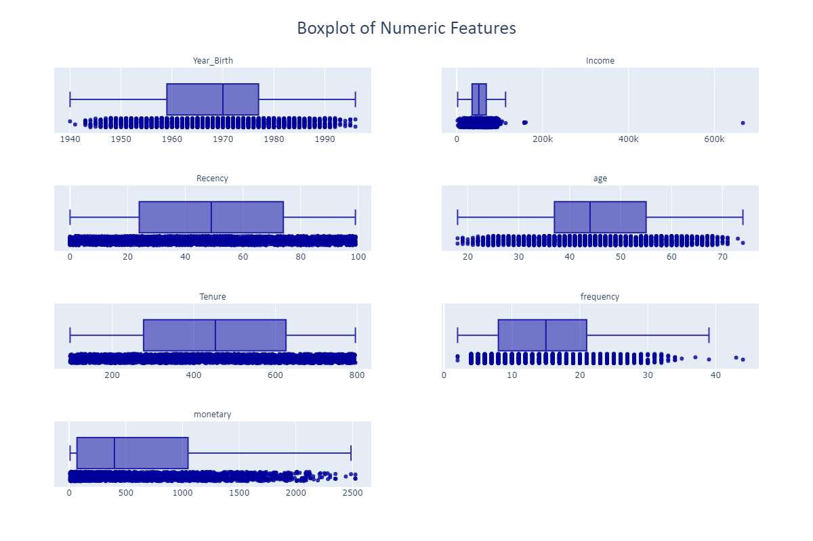

<p align="right">(<a href="#readme-top">back to top</a>)</p>

## Pearson Correlation Heatmap

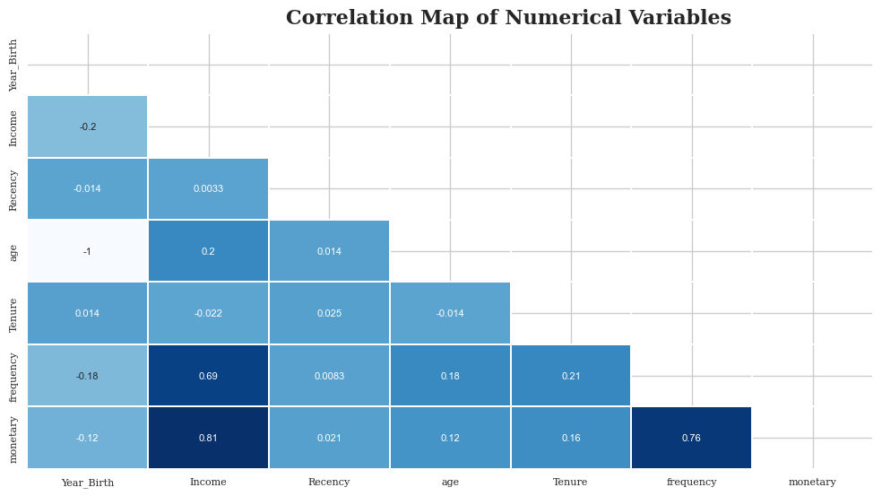

<p align="right">(<a href="#readme-top">back to top</a>)</p>

## Scatterplot

- **Monetary vs Income**
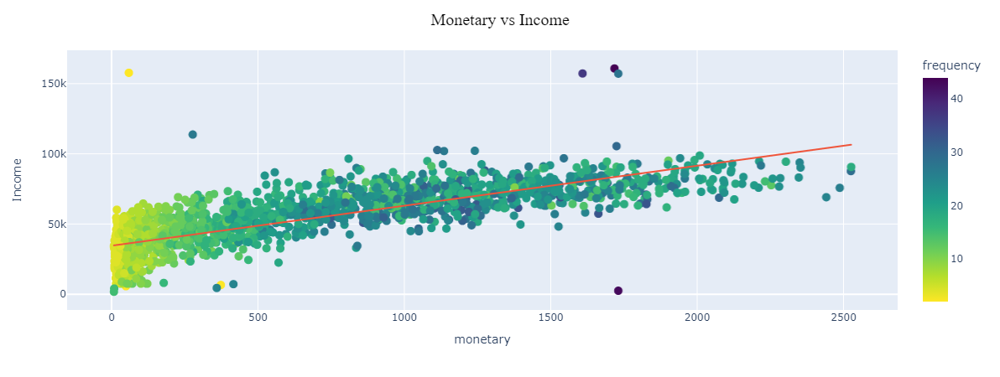

- **Frequency vs Income**
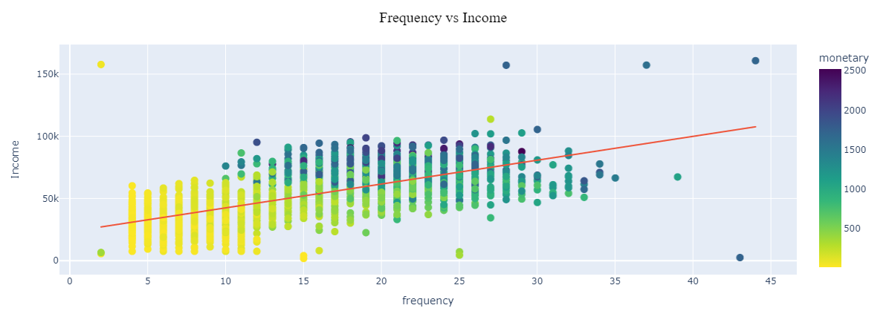

- **Frequency vs Monetary**
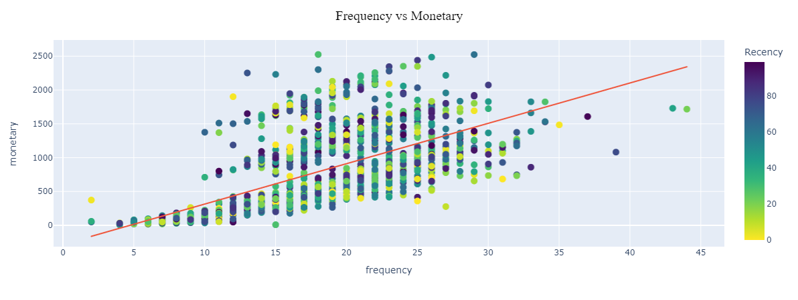

<p align="right">(<a href="#readme-top">back to top</a>)</p>

# Analyzing RFM
## Get Monetary and Frequency Values

- Monetary obtained by sum the amount spent on the 6 given product by each customer ID
- Frequency obtained by the sum the number of purchase made by customer ID on 4 categories.

Below is the distribution plot of these 3 RFM metrics

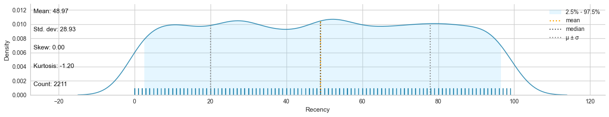
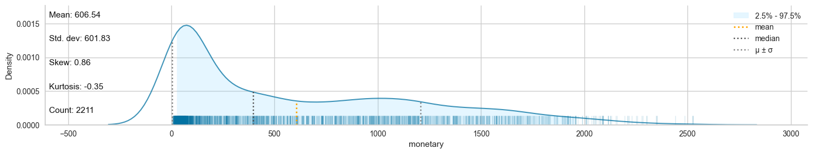
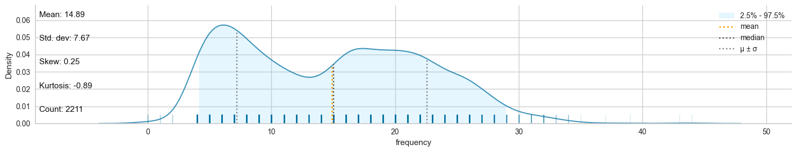

<p align="right">(<a href="#readme-top">back to top</a>)</p>

# RFM Segmentation

- **Recency**, will rate more recently more better than the less recent customer

- **Frequency**, rate the higher label to rate more often the purchase more better

- **Monetary**, rate the higher label to rate more money spent more better

<p align='center'>
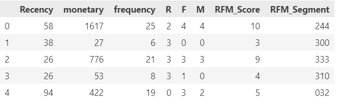
</p>

In order to keep a manageable number of segments, the segments are created using only the **recency** and **frequency** scores.  
The **monetary score** is often viewed as an aggregation metric for summarizing transactions.

RFM scoring is given following by the tables below that show RFM segment by the Range of Recency and Frequency Score

<p align='center'>

</p>

<p align="right">(<a href="#readme-top">back to top</a>)</p>

## RFM Segmentation Percentage

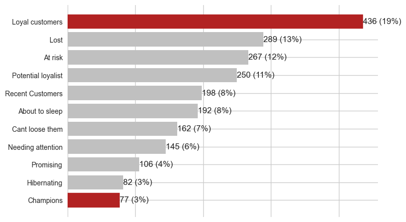

Loyal Customer segment is dominated the dataset distribution with 19%, followed by Lost Segment and At risk with 13% and 12%.

While the champions that considered as the best customer segment is located as the lowest percentage from total customers segmentations.

## RFM Segmentation Map

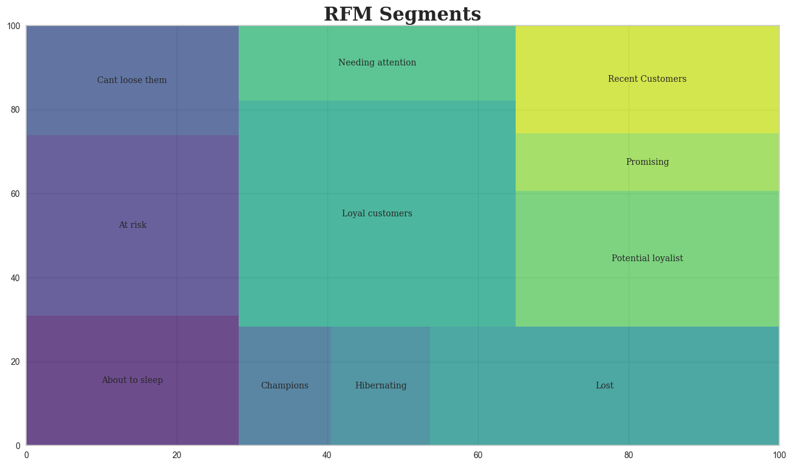

RFM Segmentation map represent the group of customer based on their Recency and Frequency.

<p align="right">(<a href="#readme-top">back to top</a>)</p>

# BG/NBD Model to predict Frequency and Customer Retention Rate

## Pareto/NBD Model
**Pareto/NBD Model** (aka **SMC Model**) describes repeat-buying behavior in settings where customer dropout is unobserved, it assumes that customers buy a steady rate for a period of time, and then become inactive.

* Time to **Churn** is modelled using the **`Pareto (Exponential-gamma mixture)`** timing model,
* **repeat-buying** behavior while active is modelled using **`NBD (Poisson-Gamma Mixture)`**

Pareto/NBD Model tell what is the probability of future number of purchase made by customer (projection of frequency) and what is the probability of the customer still being active in period of time

## BG/NBD Model
### 1. What is BG/NBD Model?
**Beta-Geometric/Negative Binomial Distribution** or **BG/NBD** Model is sligthly difference with Pareto/NBD, the only difference lies on probability of how customer being inactive. Pareto assumes that churn *can occur at any time (even before his first purchase)* while BG assumes churn *can occurs immediately after a purchase*.

The **Pareto/NBD** or **BG/NBD** requires two parameters about each customer’s past purchasing history: his
**`recency`** (when his last transaction occurred) and **`frequency`** (how many transactions he made in a specified time period).

<p align="right">(<a href="#readme-top">back to top</a>)</p>

----
### 2. BG/NBD Model Parameter
BG/NBD or BTYD model is built on 4 metrics which are closely related to the ones used for RFM segmentation :
- **`Frequency`** : represents the number of repeat purchases the customer has made. This means that it's one less than the total number of purchases. It's the count of time periods the customer had a purchase in. So if using days as units, then it's the count of days the customer had a purchase on. <br>
    &emsp;&emsp;&emsp;*Frequency = frequency - 1*

- **`Tenure (days)`** : represents the period of the customer has been enrolled in whatever time units chosen (days). This is equal to the duration between a customer's first purchase and the end of the period under observation. <br>
    &emsp;&emsp;&emsp;*Tenure = Last date in dataset - first customer purchase date*
    
- **`Recency (days)`** : represents the period of the customer when they made their most recent purchases. This is equal to the duration between a customer's first purchase and their latest purchase. (Thus if they have made only 1 purchase, the recency is 0.)<br>
    &emsp;&emsp;&emsp;*Recency = Last customer purchase date - first customer purchase date*

- **`Monetary value`** : represents the average value of a given customer's purchases. This is equal to the sum of all a customer's purchases divided by the total number of purchases. <br>
    &emsp;&emsp;&emsp;*Monetary value = monetary / frequency*

    <p align="right">(<a href="#readme-top">back to top</a>)</p>

____   
### 3. BG/NBD Model Assumptions
BG/NBD Model is based on 5 assumptions:


1. While active, number of transactions made by customer follows <b>Poisson Process</b> with <b>transaction rate λ</b>

2. Heterogenity in <b>λ</b> follows a `gamma distribution with pdf`

3. After a transaction, a customer become inactive with <b>probability <i>p</i></b>. Therefore the point at which customer `churn` is distributed across transactions according to `shifted geometric distribution with pmf`.

4. Heterogenity in <b><i>p</i></b> follows a `beta distribution with pdf`.

5. The <b>transaction rate λ</b> and <b>churn probability <i>p</i></b> vary independently across customers.

<p align="right">(<a href="#readme-top">back to top</a>)</p>

______
### 4. BG/NBD Model Result
BG/NBD Model obtain number of quantities for each customer, such as:

* $P(X(t)=x|λ, p)$ <br> 
&emsp;&emsp;&emsp; erlang-cdf that represent probability of observing $x$ transactions in a time period $t$ (Derived by $P(X(t)=x)$)

* $P(τ > t)$ = $P(active \ at \ t|λ, p$) <br> 
&emsp;&emsp;&emsp; probability of a customer becomes inactive at $τ$ (Derived by Conditional prob on $λ$ and $p$)

* $E[X(t)|λ, p]$ <br>
&emsp;&emsp;&emsp; is the expected number of transactions in a time period of length $t$ (Derived by $E[Y(t) | X = x, t_x, T]$)

<p align="right">(<a href="#readme-top">back to top</a>)</p>

______
```python
Last_date = dt.date(2014,10,4) # end of period under observation

# --- Calculate difference days between last date and Dt_Customer --- # 
dataset_clv['Tenure'] = pd.to_datetime(dataset_clv['Dt_Customer'], dayfirst=True, format='%Y-%m-%d')
dataset_clv['Tenure'] = pd.to_numeric(dataset_clv['Tenure'].dt.date.apply(lambda x: (Last_date - x)).dt.days, downcast="integer")

# --- Calculate Recency from difference days between Tenure and Recency (number of days since latest purchase) --- #
dataset_clv['U_Recency'] = dataset_clv['Tenure'] - dataset_clv["Recency"]

# --- Derived avg monetary spent by Monetary (Total Amount of purchases) / Frequency (Number of purchases) --- #
dataset_clv['Monetary_value'] = dataset_clv["monetary"] / dataset_clv['frequency']

# --- Update Frequency by -1 --- #
dataset_clv["U_Frequency"] = dataset_clv['frequency'] - 1
```

## Retention Model (Beta Geofitter)
----

For small samples sizes, the parameters can get implausibly large, so by adding an **l2 penalty the likelihood**, we can control how large these parameters can be. 

This is implemented as setting as positive **penalizer_coef** in the initialization of the model. In typical applications, penalizers on the order of 0.001 to 0.1 are effective.

```python
bg = BetaGeoFitter(penalizer_coef=0.000000005)
bg.fit(dataset_btyd['U_Frequency'], dataset_btyd['U_Recency'], dataset_btyd['Tenure'])
```
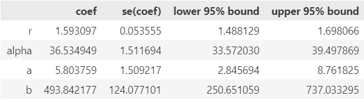

<p align="right">(<a href="#readme-top">back to top</a>)</p>

### Visualizing Frequency/Recency matrix

-----
Consider: a customer bought from you every day for three weeks straight, and we haven't heard from them in months. What are the chances they are still "alive"? `Pretty small`. 

On the other hand, a customer who historically buys from you once a quarter, and bought last quarter, is likely still alive. 

We can visualize this relationship using the Frequency/Recency matrix, which computes the expected number of transactions an artificial customer is to make in the next time period, given his or her recency (age at last purchase) and frequency (the number of repeat transactions he or she has made).

```python
g = plot_frequency_recency_matrix(bg, T = 30, **map_plot)
```

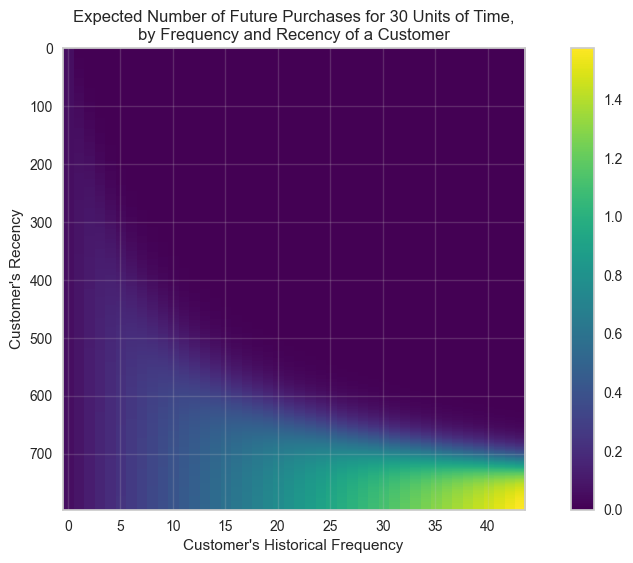

We can see that if a customer has bought 40 times, and their latest purchase was when they were 700 days old (given the individual is 700 days old), then they are your best customer (bottom-right). Your coldest customers are those that are in the top-right corner: they bought a lot quickly, and we haven't seen them in weeks.

There's also that beautiful "tail" around (5). That represents the customer who buys infrequently, but we've seen him or her recently, so they might buy again - we're not sure if they are dead or just between purchases.

```python
g = plot_probability_alive_matrix(bg, **map_plot)
```

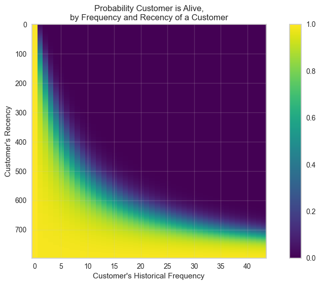

Another interesting matrix to look at is the probability of still being alive above, customer who buy infrequently but seen him recently more likely to alive as well as customer who buys frequently.

Customer who bought lot or frequently but haven't seen them recently more likely have small probability to be alive.

<p align="right">(<a href="#readme-top">back to top</a>)</p>

### Estimating Number of Purchase
-----
Based on customer history, we can predict what an individuals future purchases might look like:

```python
# calculate the number of expected repeat purchases over the next 30 days
t = 30
dataset_btyd['predicted_purchase'] = \
    bg.conditional_expected_number_of_purchases_up_to_time(
    t,
    dataset_btyd['U_Frequency'],
    dataset_btyd["U_Recency"],
    dataset_btyd["Tenure"]
    )
```

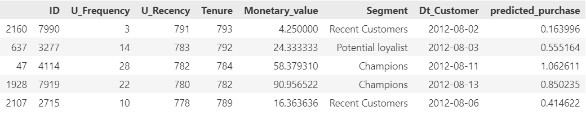

<p align="right">(<a href="#readme-top">back to top</a>)</p>

### Estimating Probability of Customer Alive (Retention Rate)
-----

Given a customer transaction history, we can calculate their probability of being alive, according to our trained model.

```python
dataset_btyd['p_alive'] = \
    bg.conditional_probability_alive(
        dataset_btyd["U_Frequency"],
        dataset_btyd["U_Recency"],
        dataset_btyd["Tenure"]
        )
```

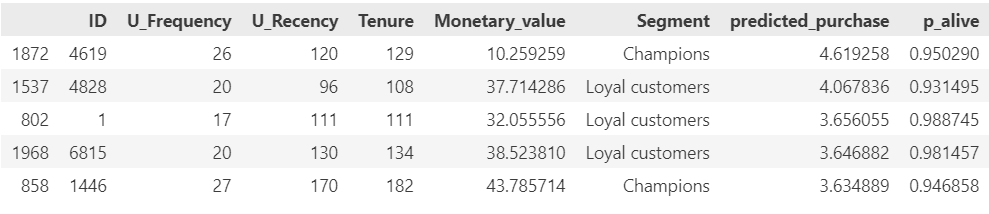

```python
dataset_btyd.groupby('Segment').agg({'p_alive':'mean'}).sort_values(by='p_alive', ascending=False)
```

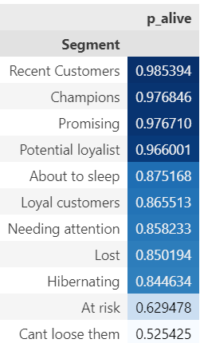

```python
sns.distplot(dataset_btyd['p_alive'])
```

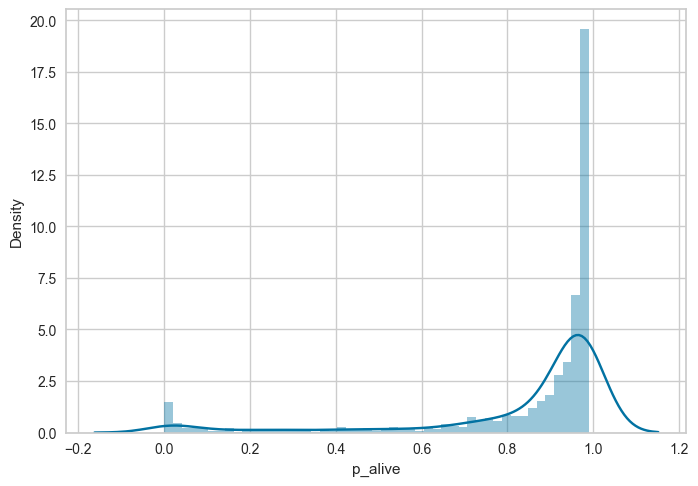

<p align="right">(<a href="#readme-top">back to top</a>)</p>

## LTV Modelling
### Estimate the average transaction value
--------
**`monetary_value`** can be used to represent profit, or revenue, or any value as long as it is consistently calculated for each customer.

```python
gg = GammaGammaFitter(penalizer_coef=0.00005)
gg.fit(frequency=dataset_btyd["U_Frequency"], 
       monetary_value=dataset_btyd["Monetary_value"])
```

The Gamma-Gamma submodel, in fact, assumes that there is no relationship between the monetary value and the purchase frequency. In practice we need to check whether the Pearson correlation between the two vectors is close to 0 in order to use this model.

```python
dataset_btyd["predicted_sales"] = \
    gg.conditional_expected_average_profit(
        dataset_btyd["U_Frequency"],
        dataset_btyd["Monetary_value"]
        )
```

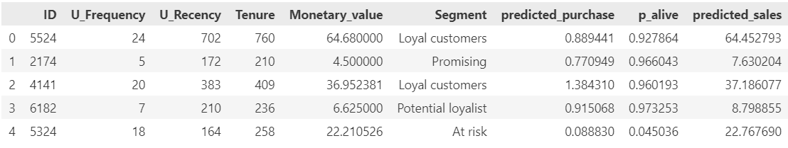

```python
dataset_btyd.groupby('Segment').agg({'predicted_sales':'mean'}).sort_values(by='predicted_sales', ascending=False)
```
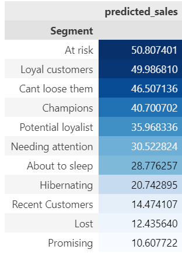

<p align="right">(<a href="#readme-top">back to top</a>)</p>

### Estimating Customer Lifetime Value
----

```python
dataset_btyd["LTV"] = gg.customer_lifetime_value(
    bg, 
    dataset_btyd["U_Frequency"],
    dataset_btyd["U_Recency"],
    dataset_btyd["Tenure"],
    dataset_btyd["Monetary_value"],
    time = 12,
    freq = "D",
    discount_rate = 0.01
)

dataset_btyd.sort_values(by="predicted_sales", ascending=False).head(10)
```

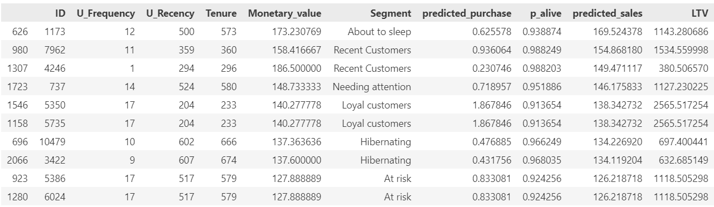

<p align="right">(<a href="#readme-top">back to top</a>)</p>

# Conclusion

```python
dataset_btyd_ltv = \
    dataset_btyd.groupby('Segment').agg({'LTV':'mean'}).sort_values('LTV', ascending=False)
```

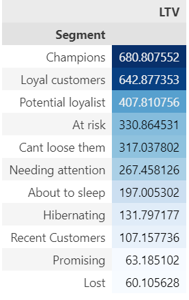

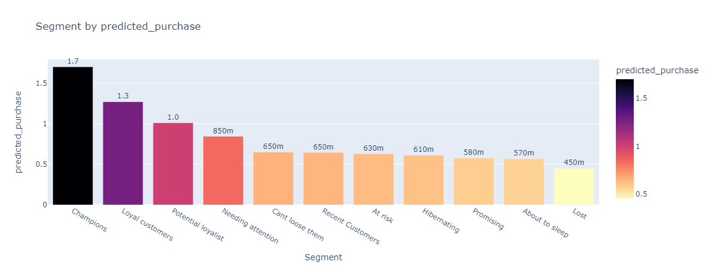

- **Predicted Purchase**<br>
Champions have the highest predicted_purchase, followed by Loyal Customer and Potential Loyalist<br>
<br>
While About to sleep and lost have the lowest predicted_purchase since these segment more likely to have low recency and low frequency

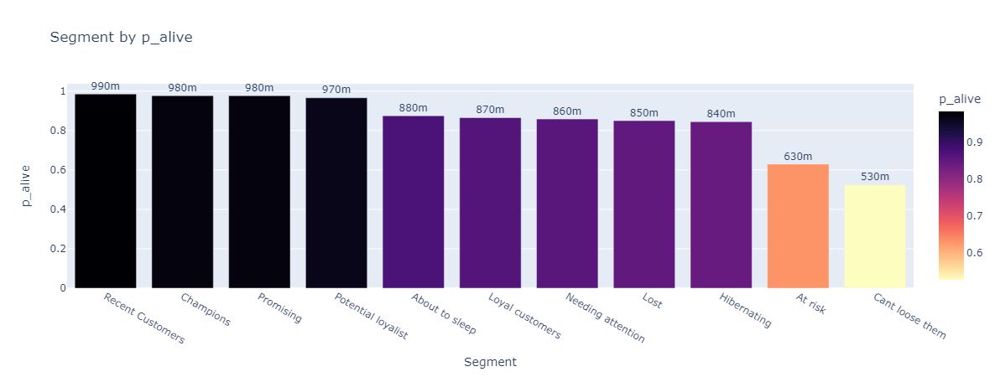

- **Customer Retention**<br>
Probability of customer to being alive in future have Recent Customer, Champions, and Promising with the highest probability since these segments have high recency as well.

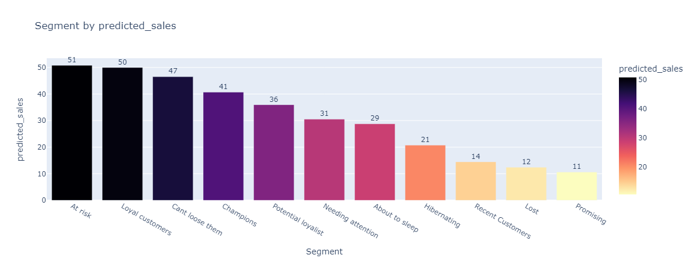

- **Predicted_sales**<br>
Future potential avg transaction or sales for each segments have At risk segments with the highest potential sales followed by Loyal Customers and Can't loose them,<br>
<br>
While Recent customer, Lost and Promising have the the lowest potential avg transactions in the future with low monetary values and low frequency.

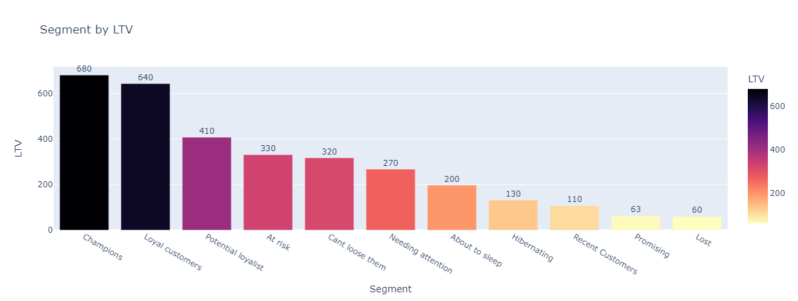

- **Lifetime Values**<br>
Champions and Loyal Customers have dominated as the segments that typically have high LTV while Recent Customer, Promising and Lost more likely have low LTV.